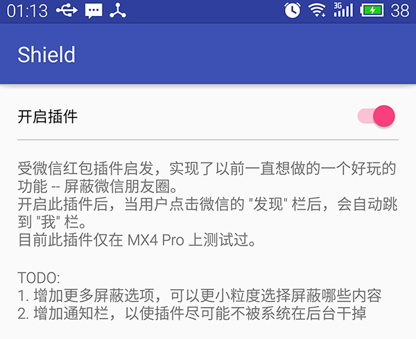

# Shield

受[微信红包插件](https://github.com/geeeeeeeeek/WeChatLuckyMoney)启发 (感谢作者 @geeeeeeeeek)，写了一个以前一直想实现的功能 -- 屏蔽微信朋友圈，只是为了好玩而已。

开启此插件后，当用户点击微信的 "发现" 栏后，会自动跳到 "我" 栏。

目前此插件仅在 MX4 Pro 上测试过。

### TODO:
1. 增加更多屏蔽选项，可以更小粒度地控制屏蔽内容
2. 增加通知栏，以使插件尽可能不被系统在后台干掉

#### 演示效果图：

[GIF 体积太大，看这里](http://weibo.com/1666522694/D74CL18lg?from=page_1005051666522694_profile&wvr=6&mod=weibotime&type=comment#_rnd1449335990049)

#### APK

[下载](apk/shield-debug.apk)