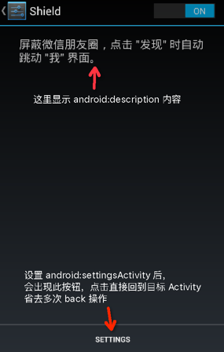

# Shield

受 [微信红包插件](https://github.com/geeeeeeeeek/WeChatLuckyMoney) 启发 (感谢作者 @geeeeeeeeek)，写了一个以前一直想实现的功能 -- 屏蔽微信朋友圈。开启此插件后，当用户点击微信的 "发现" 栏后，会自动跳到 "我" 栏。(当然，后来证明这类工具实际并没有什么卵用，更何况后来我知道微信自带屏蔽朋友圈功能，只当是用来学习 AccessibilityService。)

#### 演示效果图：

仅在 MX4 Pro 上测试过。

 

[GIF 体积太大，看这里](http://weibo.com/1666522694/D74CL18lg?from=page_1005051666522694_profile&wvr=6&mod=weibotime&type=comment#_rnd1449335990049)

[下载 APK](apk/app-debug.apk)
